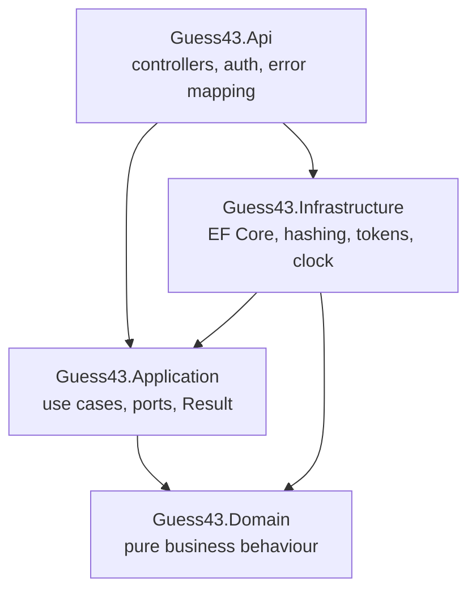
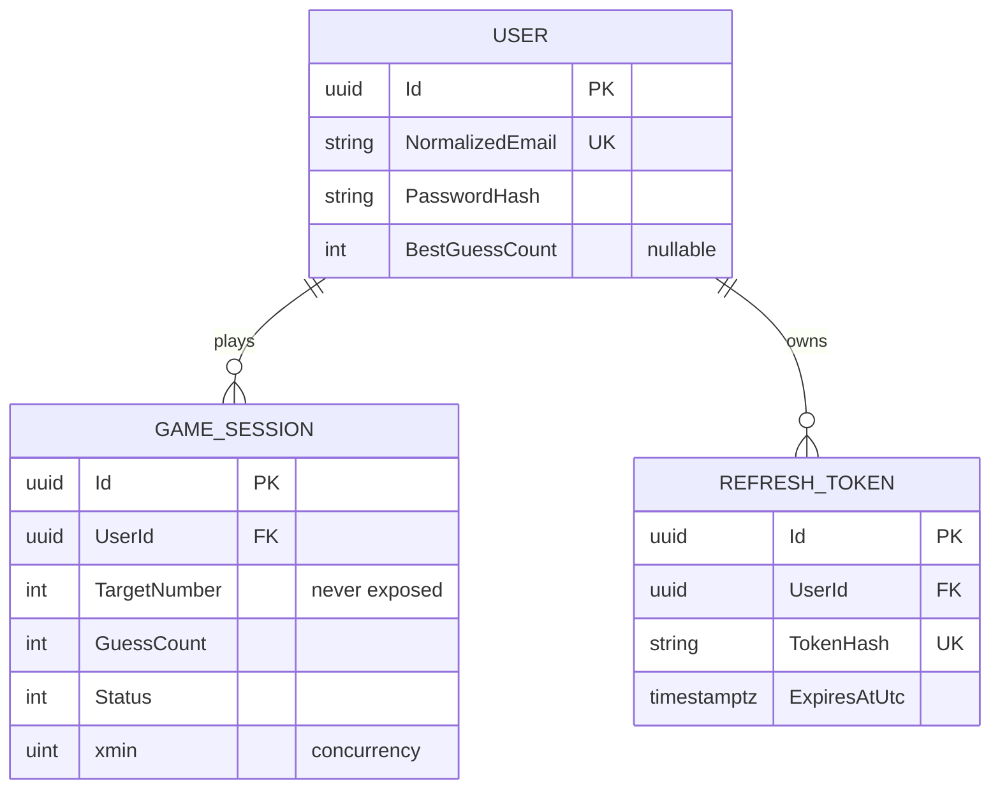

# Guess43

A full-stack **Guess the Number** game. Sign up, log in, and try to guess a secret
integer from **1 to 43** in as few attempts as possible. The backend is
server-authoritative and persists your **lowest number of guesses** (your personal
best), shown every time you return.

Built as an interview-grade assessment: pragmatic Clean Architecture, secure auth,
real PostgreSQL, comprehensive tests, containerised delivery, and a reproducible
cloud deployment blueprint.

> **Live app / Swagger:** not yet deployed from this environment (no cloud
> credentials were available). All deployment artifacts are complete — see
> [Deployment](#deployment). No fabricated URLs are included.

---

## Assignment coverage

| Requirement | Status |
| --- | --- |
| React + PostgreSQL full-stack CRUD | ✅ React 19 + TS SPA, PostgreSQL via EF Core |
| Register, login, logout | ✅ JWT access + rotating refresh-cookie |
| Secure credential storage | ✅ ASP.NET Core `PasswordHasher` (PBKDF2) |
| Secret number 1–43, server-side | ✅ `RandomNumberGenerator.GetInt32(1, 44)` |
| Higher / lower / correct feedback | ✅ Server-authoritative `SubmitGuess` |
| Persist lowest guess count (one nullable field) | ✅ `User.BestGuessCount` |
| Show personal best on next login | ✅ Returned by `GET /api/users/me` and on login |
| One thoughtful bonus feature | ✅ Performance dashboard + achievements + confetti |
| Stored in GitHub | ✅ Conventional-commit history (see below) |
| Deployed to a cloud platform | ⏳ Render blueprint ready; deploy is an external step |

---

## Tech stack

- **Backend:** ASP.NET Core 10 Web API, C#, nullable + warnings-as-errors
- **Frontend:** React 19, TypeScript (strict), Vite
- **Database:** PostgreSQL, EF Core, Npgsql
- **Validation:** FluentValidation · **Logging:** Serilog · **Docs:** Swagger
- **Tests:** xUnit, FluentAssertions, Testcontainers, NetArchTest (backend);
  Vitest, React Testing Library, MSW (frontend); Playwright (E2E)
- **Delivery:** Docker, Docker Compose, GitHub Actions, Render

> The brief specified ASP.NET Core 8; the build machine only had the **.NET 10 SDK**,
> so the solution targets **net10.0**. No .NET 8-only behaviour is relied upon.

---

## Architecture

Pragmatic Clean Architecture with strictly inward dependencies, enforced by
architecture tests.



- **Domain** — entities, value objects, invariants; no external dependencies.
- **Application** — use-case handlers, ports (repositories, hashing, tokens, clock),
  `Result<T>`/`Error`. Aggregate-specific repositories (no generic repo), one
  `IUnitOfWork` transaction boundary.
- **Infrastructure** — EF Core (`AppDbContext`, configurations, repositories),
  `PasswordHasher`, JWT + refresh-token services, `SystemClock`, secure RNG.
- **Api** — thin controllers, JWT auth, rate limiting, `ProblemDetails` mapping,
  health checks, and (in production) same-origin SPA hosting.

Full write-up: [docs/architecture.md](docs/architecture.md) ·
Task breakdown: [docs/implementation-plan.md](docs/implementation-plan.md).

### Data model (ER)



---

## Security decisions

- Passwords hashed with the framework `PasswordHasher` (never hand-rolled crypto).
- Short-lived **JWT access token** returned to the SPA and kept **in memory** only.
- **Rotating refresh token** stored as a SHA-256 hash; delivered in a
  `Secure`, `HttpOnly`, `SameSite=Strict` cookie scoped to `/api/auth`.
- Refresh **rotation + reuse detection**: presenting a rotated token revokes the
  whole family.
- Same generic `INVALID_CREDENTIALS` for unknown email vs wrong password, with
  password verification performed even when the account is missing (timing).
- User id always derived from validated JWT claims — never trusted from the client.
- The secret `TargetNumber` is never exposed in any DTO, log, or error.
- Rate limiting on register/login/refresh/guess. Central `ProblemDetails` with a
  stable `errorCode` and `traceId`; unexpected errors are logged once and sanitized.

---

## API endpoints

| Method | Route | Auth | Description |
| --- | --- | --- | --- |
| POST | `/api/auth/register` | – | Create account, returns access token + sets refresh cookie |
| POST | `/api/auth/login` | – | Authenticate |
| POST | `/api/auth/refresh` | cookie | Rotate tokens |
| POST | `/api/auth/logout` | ✅ | Revoke refresh-token family |
| GET | `/api/users/me` | ✅ | Profile + personal best |
| PUT | `/api/users/me` | ✅ | Update display name |
| DELETE | `/api/users/me` | ✅ | Delete account + data (one transaction) |
| POST | `/api/games` | ✅ | Start or return the active game |
| GET | `/api/games/active` | ✅ | Restore active game (204 if none) |
| POST | `/api/games/{id}/guesses` | ✅ | Submit a guess |
| GET | `/api/games?page&pageSize` | ✅ | Paginated history |
| GET | `/api/games/{id}` | ✅ | Owned game summary |
| DELETE | `/api/games/{id}` | ✅ | Delete an owned completed game |
| GET | `/api/stats/performance` | ✅ | Bonus: stats + achievements |
| GET | `/health/live`, `/health/ready` | – | Liveness / readiness |

Stable error codes: `VALIDATION_ERROR`, `EMAIL_ALREADY_EXISTS`,
`INVALID_CREDENTIALS`, `GAME_NOT_FOUND`, `GAME_ALREADY_COMPLETED`,
`GUESS_OUT_OF_RANGE`, `CONCURRENCY_CONFLICT`.

---

## Getting started

### Prerequisites

- Docker + Docker Compose (for the one-command run)
- For local dev: .NET 10 SDK, Node 22+

### One-command run (Docker Compose)

```bash
cp .env.example .env        # then set JWT_SIGNING_KEY (e.g. openssl rand -base64 48)
docker compose up --build
```

The app is served from a single origin at **http://localhost:8080** (API + SPA).
The database migration is applied automatically on startup.

### Local development

Backend:

```bash
dotnet run --project src/backend/Guess43.Api      # http://localhost:5063, Swagger at /swagger
```

Frontend (proxies `/api` to the backend, keeping cookies first-party):

```bash
cd src/frontend/guess43-web
npm install
npm run dev                                         # http://localhost:5173
```

> Local dev needs a PostgreSQL instance. The quickest option is
> `docker compose up db`, which matches the default dev connection string.

---

## Commands

### Backend

```bash
dotnet build Guess43.slnx -c Release                       # warnings as errors
dotnet test tests/Guess43.Domain.Tests/...                 # per-project, or:
dotnet test Guess43.slnx --collect:"XPlat Code Coverage"   # all tests + coverage
dotnet ef migrations add <Name> \
  --project src/backend/Guess43.Infrastructure \
  --startup-project src/backend/Guess43.Api \
  --output-dir Persistence/Migrations
dotnet format Guess43.slnx --verify-no-changes             # formatting check
```

Integration tests use **Testcontainers** and require a running Docker daemon.

### Frontend

```bash
cd src/frontend/guess43-web
npm run lint
npm run typecheck
npm run test          # Vitest (unit/component)
npm run build         # tsc + vite production build
npm run e2e           # Playwright (needs the full stack running)
```

### Quality

```bash
# Sonar analysis runs in CI when SONAR_TOKEN et al. are configured (see below).
```

---

## Configuration

Configuration is supplied via environment variables (double-underscore nesting).
No secrets are committed. See [.env.example](.env.example).

| Variable | Description |
| --- | --- |
| `ConnectionStrings__Postgres` | PostgreSQL connection (keyword or `postgres://` URI) |
| `Jwt__SigningKey` | JWT signing secret (≥ 32 bytes) — **required** |
| `Jwt__Issuer`, `Jwt__Audience` | JWT issuer/audience |
| `RefreshToken__Days`, `RefreshToken__CookieName` | Refresh token lifetime / cookie |
| `Database__MigrateOnStartup` | Apply migrations on startup (default `true`) |
| `Cors__AllowedOrigins__0` | Dev-only allowed SPA origin |
| CI secrets | `SONAR_TOKEN`, `SONAR_HOST_URL`, `SONAR_ORGANIZATION`, `SONAR_PROJECT_KEY` |

---

## CI/CD

[.github/workflows/ci.yml](.github/workflows/ci.yml) runs on push/PR:

- **backend** — restore, format check, build (warnings as errors), tests + coverage.
- **frontend** — `npm ci`, format check, lint, type-check, tests + coverage, build.
- **docker** — builds the production image.
- **sonar** — runs when `SONAR_TOKEN` is configured; otherwise reports the Quality
  Gate as **blocked, not passed**.

---

## Deployment

A reproducible Render blueprint is provided in [render.yaml](render.yaml): one Docker
web service (same-origin SPA + API) plus managed PostgreSQL, HTTPS-aware forwarded
headers, a `/health/ready` health check, and safe migration on startup. The
`Jwt__SigningKey` is set in the dashboard (`sync: false`), never committed.

Deployment is an external action requiring account access, which was not available
in this environment. To deploy: push to GitHub, create a Render Blueprint from the
repo, set `Jwt__SigningKey`, and deploy. No live URL is claimed until verified.

---

## Bonus feature — Performance dashboard & achievements

Computed on demand from your own completed games: games won, average guesses, recent
performance, and achievements (`First Win`, `Sharp Shooter` for ≤ 6 guesses,
`Personal Best`). A reduced-motion-aware confetti burst celebrates a win or new
record. No extra persistence — statistics are derived from existing records.

---

## Assumptions, trade-offs & next steps

- **net10.0** instead of net8.0 (installed SDK). Behaviourally equivalent here.
- **Aggregate repositories + `xmin` concurrency token** over a generic repository —
  clearer intent, native optimistic concurrency, no extra column.
- **Personal best as a single `User` field** matches the assignment precisely; richer
  stats are derived on the fly for the bonus rather than denormalised.
- **Same-origin production hosting** keeps the refresh cookie first-party and secure.
- **Next steps:** deploy to Render and verify the live journey; wire a real Sonar
  project; add refresh-token cleanup job; expand Playwright coverage in CI against a
  compose-provisioned stack.

## Tests at a glance

- Backend: **46** tests — 17 domain, 15 application, 5 architecture, 9 integration
  (Testcontainers + real PostgreSQL). All green.
- Frontend: **6** tests — auth, protected routes, game flow, API refresh. All green.
