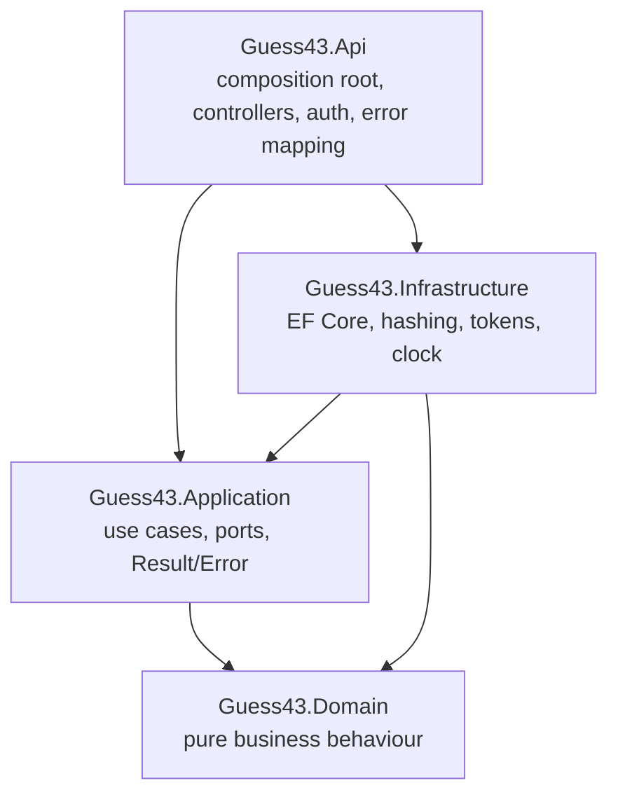
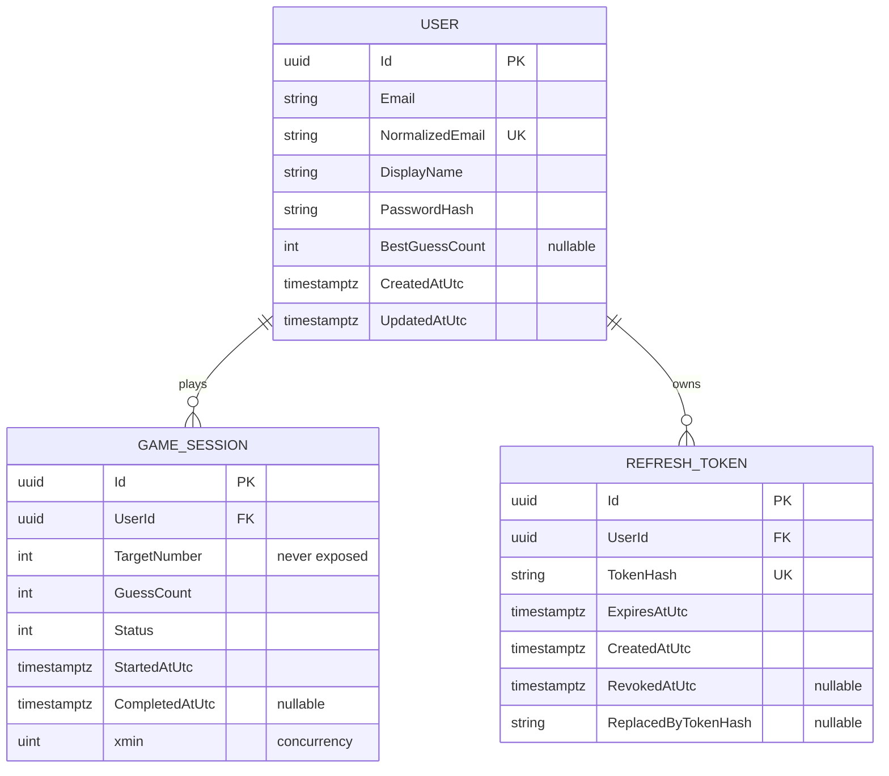

# Guess43 — Architecture

## 1. Purpose & scope

Guess43 is a full-stack "Guess the Number" game. An authenticated user plays a
server-authoritative game where the backend generates a secret integer from 1–43,
accepts guesses, replies `Higher` / `Lower` / `Correct`, and persists the user's
**lowest number of guesses** (one nullable personal-best field) shown on every login.

The solution demonstrates real CRUD (account/profile and game history), secure
authentication, and production-quality engineering within a two-day assessment.

## 2. Technology baseline

| Layer | Technology |
| --- | --- |
| Backend | ASP.NET Core 10 Web API, C#, nullable reference types, warnings-as-errors |
| Frontend | React 19 + TypeScript + Vite |
| Database | PostgreSQL + EF Core + Npgsql |
| API docs | OpenAPI / Swagger |
| Backend tests | xUnit, FluentAssertions, Testcontainers (PostgreSQL) |
| Frontend tests | Vitest, React Testing Library, MSW |
| E2E | Playwright |
| Validation | FluentValidation |
| Logging | `ILogger<T>` + Serilog |
| Quality | Sonar (Cloud/Qube), ESLint, Prettier, TS strict |
| Delivery | Docker, Docker Compose, GitHub Actions, Render blueprint |

> **Framework note:** the original brief specified ASP.NET Core 8. The build
> environment only had the .NET 10 SDK installed, so the solution targets
> **net10.0**. All APIs used are available and stable on .NET 10; no .NET 8-only
> behaviour is relied upon.

## 3. Clean Architecture

Pragmatic Clean Architecture — four backend projects with strict inward dependencies.

```text
Api  ──►  Application  ──►  Domain
             ▲
Infrastructure ──────────────┘  (implements Application ports)
```



Dependency rules (enforced by architecture tests):

- **Domain** depends on nothing; contains entities, value objects, invariants.
- **Application** depends only on Domain; defines use cases and ports (interfaces).
- **Infrastructure** implements Application ports (EF Core, PostgreSQL, hashing,
  JWT, refresh tokens, time). No EF types leak outward.
- **Api** is the composition root: thin controllers, auth config, error mapping.
- **Frontend** consumes HTTP contracts only; no duplicated server rules.

**Deliberately excluded** (no value here): MediatR, generic `IRepository<T>`,
AutoMapper, event bus, microservices, Redis, Kubernetes.

## 4. Repositories & Unit of Work

Aggregate-specific repositories, interfaces in Application, EF implementations in
Infrastructure. Repositories expose business operations, never `IQueryable`/EF
entities. They stage changes; they never call `SaveChanges`.

- `IUserRepository`
- `IGameSessionRepository`
- `IRefreshTokenRepository`
- `IUnitOfWork` — `SaveChangesAsync` is the use-case transaction boundary.

Completing a game and updating the personal best happen in **one commit** so they
are atomic. Explicit transactions only where multiple persistence steps truly
require them (e.g. account deletion cascade).

## 5. Domain model

### User aggregate
`Id, Email, NormalizedEmail, DisplayName, PasswordHash, BestGuessCount (nullable),
CreatedAtUtc, UpdatedAtUtc`. Unique case-insensitive index on `NormalizedEmail`.
`BestGuessCount` only improves — updated after a completed game with a smaller
positive guess count (encapsulated in the aggregate).

### GameSession aggregate
`Id, UserId, TargetNumber, GuessCount, Status(Active|Completed), StartedAtUtc,
CompletedAtUtc, Version(concurrency token)`.

- Secret generated server-side via `RandomNumberGenerator.GetInt32(1, 44)`.
- `TargetNumber` never exposed in any DTO, log, error, Swagger example, or FE state.
- `SubmitGuess`: accepts 1–43, rejects after completion, increments once per
  accepted guess, returns Higher/Lower/Correct, marks complete + timestamp on win.
- At most one active session per user — enforced in app logic **and** a PostgreSQL
  partial unique index. A repeat start returns the existing active session.

### RefreshToken entity
Stores only the **hash** of each token + `UserId, ExpiresAtUtc, CreatedAtUtc,
RevokedAtUtc, ReplacedByTokenHash`. Enables rotation and reuse detection. Plaintext
never stored or logged.

### ER diagram


## 6. Authentication

Endpoints: `POST /api/auth/{register,login,refresh,logout}`,
`GET/PUT/DELETE /api/users/me`.

- Passwords hashed with ASP.NET Core `PasswordHasher<User>` (never hand-rolled).
- Short-lived JWT access token returned to SPA, kept **in memory**.
- Rotating refresh token in a `Secure`, `HttpOnly`, `SameSite` cookie; hash stored.
- Logout revokes the current refresh-token family and clears the cookie.
- Same generic failure for unknown email vs wrong password (`INVALID_CREDENTIALS`).
- Rate-limit register/login/refresh/guess.
- User id always derived from validated JWT claims, never from client input.
- `GET /api/users/me` returns profile + nullable personal best.
- Account deletion revokes sessions and removes dependent game data in one tx.

**Same-origin in production:** the production Docker image builds React and serves
the SPA from the ASP.NET Core origin, so the refresh cookie stays first-party.
Locally, Vite and the API run separately with narrow dev CORS.

## 7. Game & CRUD API

`POST /api/games` (start or return active), `GET /api/games/active`,
`POST /api/games/{id}/guesses`, `GET /api/games?page&pageSize` (paged, max size),
`GET /api/games/{id}`, `DELETE /api/games/{id}` (completed only; never erases
personal best). `404` (not leakage) for absent/other-user resources.

## 8. Error model

`Result<T>` + `Error(Code, Description, Category)` for expected failures — no
exceptions for validation/not-found/conflict/unauthorized. Central mapping to
RFC `ProblemDetails` with stable `errorCode` + `traceId`. Codes:
`VALIDATION_ERROR, EMAIL_ALREADY_EXISTS, INVALID_CREDENTIALS, GAME_NOT_FOUND,
GAME_ALREADY_COMPLETED, GUESS_OUT_OF_RANGE, CONCURRENCY_CONFLICT`. Unexpected
exceptions go through `IExceptionHandler` → sanitized 500, logged once.

## 9. Logging & observability

Structured logs via Serilog. API logs method/path/status/duration/correlation-id.
Application logs domain events (account created, game start/complete, new best).
Never log passwords, hashes, tokens, cookies, auth headers, or target numbers.
`/health/live` and `/health/ready` (ready verifies PostgreSQL).

## 10. Frontend

Feature-based React: `app`, `features/{auth,game,history,dashboard,profile}`,
`shared`. Protected + guest-only routes. Centralized typed API client with a
single refresh-on-401 (no loops/stampedes, retry once), keyed off stable
`errorCode`. React error boundary. Accessible, responsive, reduced-motion aware.

## 11. Bonus

Performance Dashboard & Achievements computed from owned records: completed count,
best score, average guesses, recent performance, achievements (`First Win`,
`Sharp Shooter` ≤6, `Personal Best`), and reduced-motion-aware confetti. No extra
table unless persistence is required.

## 12. Key trade-offs

- **net10.0 over net8.0** — dictated by installed SDK; behaviourally equivalent here.
- **Aggregate repositories over generic repo** — clearer intent, testable seams.
- **`xmin` concurrency token** — native Npgsql optimistic concurrency, no extra column.
- **Personal best as a single field on User** — matches the assignment precisely;
  richer stats derived on the fly for the bonus rather than denormalized.
- **Same-origin production hosting** — keeps refresh cookie first-party & secure.
